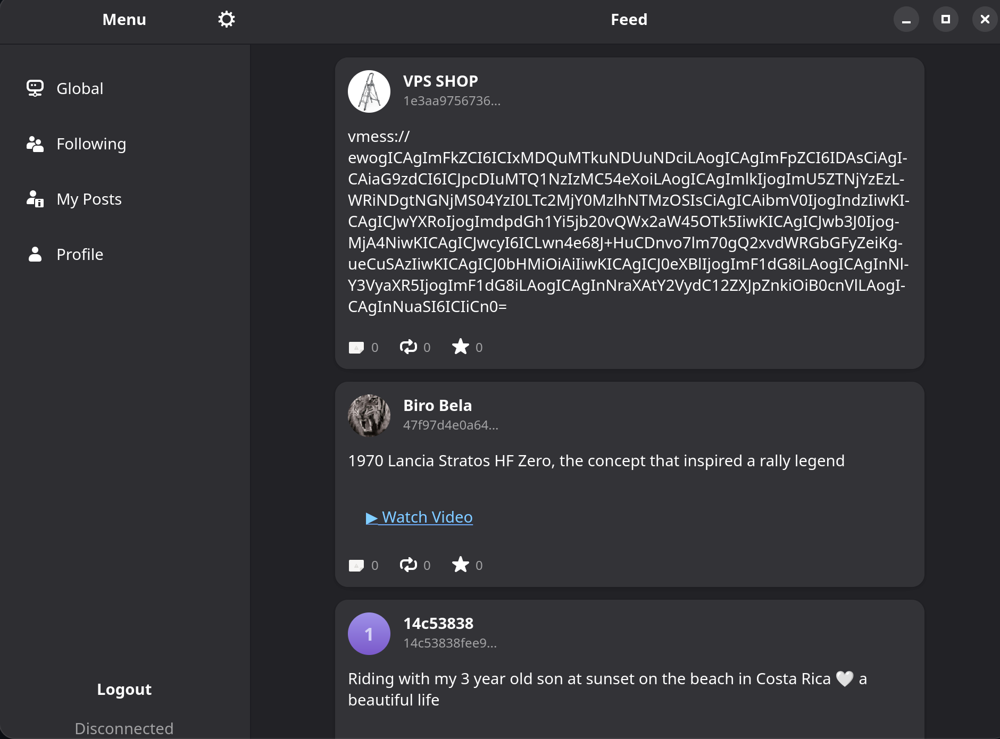

# Gnostr (Under Construction)

Gnostr is a native Linux Nostr client designed specifically for the GNOME Desktop environment.  It leverages an adaptive user interface, providing a great experience on both desktop and mobile Linux devices, such as the Librem 5 or PinePhone.

## Features
[](screenshot.png)
*   **Adaptive UI:** Utilizes `Adw.NavigationSplitView` for a sidebar layout on desktop and a navigation stack on mobile, ensuring a consistent and intuitive experience across different screen sizes.
*   **Secure Storage:** Private keys (nsec) are stored securely in the system keyring using `libsecret`, preventing exposure of sensitive data in plain text.
*   **Nostr Protocol:** Connects to relays via WebSockets to fetch and publish events. (Currently focused on read-only functionality).
*   **GNOME Integration:**  Built with GNOME technologies for seamless integration with the desktop environment.

## Getting Started
Use Flatpak Builder to build this application.
```
flatpak-builder --force-clean --repo=repo build_dir me.velocitynet.Gnostr.json
flatpak build-bundle repo gnostr.flatpak me.velocitynet.Gnostr
```

Prebuilt flatpaks are available within the repo for Arm and x86.

## Buy me a beer

If you like this project and would like to support its development:

bc1qkgcg44wxmmjrt5uvnya5g2zqd84pm6mawjp3s

## License

This project is licensed under the GPL 3 License. See the LICENSE file for details.
