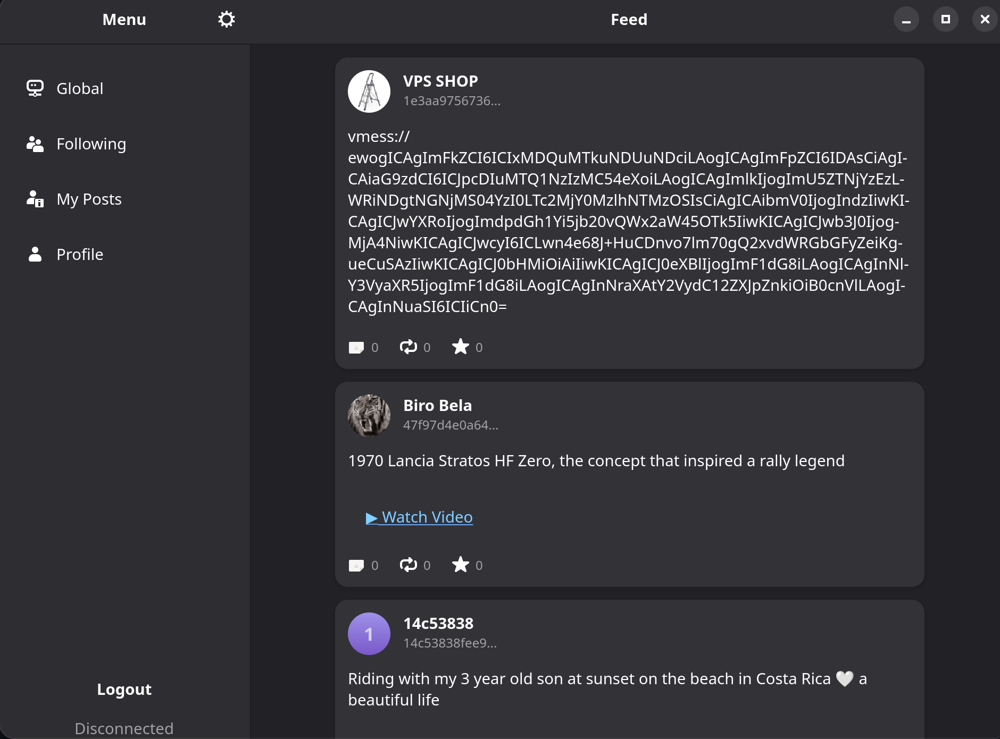

# Gnostr (Under Construction)

Gnostr is a native Linux Nostr client designed specifically for the GNOME Desktop environment. It leverages an adaptive user interface, providing a great experience on both desktop and mobile Linux devices, such as the Librem 5 or PinePhone.

## Features

[](screenshot.png)

*   **Adaptive UI:** Utilizes `Adw.NavigationSplitView` for a sidebar layout on desktop and a navigation stack on mobile, ensuring a consistent and intuitive experience across different screen sizes.
*   **Secure Storage:** Private keys (nsec) are stored securely in the system keyring using `libsecret`, preventing exposure of sensitive data in plain text.
*   **Nostr Protocol:** Connects to relays via WebSockets to fetch and publish events. (Currently focused on read-only functionality).
*   **GNOME Integration:** Built with GNOME technologies for seamless integration with the desktop environment.

## Getting Started

### Prerequisites

*   Python 3.11+
*   GTK4, libadwaita-1
*   GStreamer 1.0 with plugins (uridecodebin, gtk4paintablesink)
*   pytest, black, flake8 (for development)

### Building

Use Flatpak Builder to build this application.

```bash
flatpak-builder --force-clean --repo=repo build_dir tech.livingonlinux.gnostr.json
flatpak build-bundle repo gnostr.flatpak tech.livingonlinux.gnostr
```

### Running Tests

```bash
# Run with xvfb for headless display
xvfb-run pytest tests/

# Or run without xvfb (if display available)
pytest tests/
```

### Linting

```bash
# Format code
black src/ tests/
isort src/ tests/

# Check linting
flake8 src/ tests/ --max-line-length=120
```

Prebuilt flatpaks are available within the repo for Arm and x86.

## Buy me a beer

If you like this project and would like to support its development:

bc1qkgcg44wxmmjrt5uvnya5g2zqd84pm6mawjp3s

## License

This project is licensed under the MIT License. See the LICENSE file for details.
